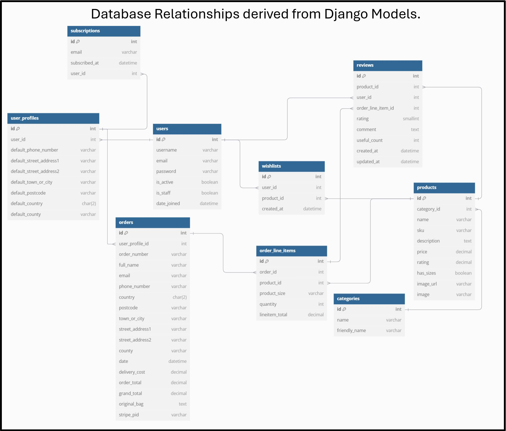

# Charmed & Crafted  
## Your Destination for Unique Artisan Creations  

Welcome to **Charmed & Crafted**, an e-commerce platform dedicated to showcasing and selling handcrafted, one-of-a-kind products. 
Discover unique candles, charms, and personalized gifts made with love and care by talented artisans. 
Whether you're shopping for yourself or looking for the perfect gift, **Charmed & Crafted** is here to bring artisanal beauty to your doorstep.


## Explore Our Collections  
[Visit Charmed & Crafted Online Store](https://charmedandcrafted-65c7adf04e90.herokuapp.com/)  


## Project Overview

### Purpose:

This project serves as an **educational resource**, showcasing **Full Stack development** skills in building a comprehensive, fully functional **e-commerce platform**. It demonstrates how **Django** can be effectively leveraged to create a **scalable**, **interactive**, and **secure application**, with a strong emphasis on **user experience**, **data management**, and **thorough testing**.

### Key Features:
- **Secure Payments**: Integrated **Stripe Payments** for reliable and secure online transactions.  
- **Product Management**: Supports product browsing, advanced filtering, and detailed product views.  
- **Scalable Storage**: Utilizes **AWS S3** for efficient storage of media and static files.  
- **Responsive Design**: Achieved through **Bootstrap**, ensuring a visually appealing and mobile-friendly interface.  

This project exemplifies the power of combining **Python**, **Django**, **Bootstrap**, **Stripe**, and **AWS** to build a **secure**, **scalable**, and **user-friendly** web application. It addresses real-world considerations like payment integration, storage reliability, performance, and overall scalability.

### **Charmed & Crafted - E-Commerce Business Model**

<details>
<summary>1. Business Overview</summary>

Charmed & Crafted is an online store specializing in **handcrafted artisan products**. The platform offers unique and carefully crafted items, including gifts, home decor, and personalized goods, targeting customers seeking high-quality, handmade alternatives to mass-produced products.

The business operates under the **Direct-to-Consumer (DTC)** model, where products are sourced and shipped directly to customers through the Charmed & Crafted website.

</details>

---

<details>
<summary>2. Key Features of the Business</summary>

- **Unique Product Range**: Focus on handcrafted artisan goods.  
- **Seamless Shopping Experience**: Intuitive user interface with product search, category browsing, and secure checkout.  
- **Customer Focus**: Personalized customer support, workshop opportunities, and tailored marketing communications.  
- **Sustainability**: Commitment to eco-friendly materials and ethical production processes.

</details>

---

<details>
<summary>3. Search Engine Optimization (SEO)</summary>

- Optimize the website content with relevant keywords (e.g., "handcrafted gifts," "artisan home decor").  
- Use **meta tags**, **image alt attributes**, and **sitemaps** to improve organic search rankings.  
- Implement descriptive product pages with engaging content to attract search engine crawlers.

</details>

---

<details>
<summary>4. Social Media Marketing</summary>

- **Platforms**: Instagram, Facebook, Pinterest, and TikTok.  
- Showcase visually appealing product photos, videos, and stories.  
- Run social media ad campaigns targeting audiences interested in handmade goods, gifting, and home decor.  
- Partner with **micro-influencers** to promote specific products.

</details>

---

<details>
<summary>5. Email Marketing</summary>

- Offer incentives (e.g., discounts) for customers who subscribe to newsletters.  
- Send weekly newsletters highlighting:  
  - New arrivals  
  - Exclusive discounts  
  - Customer success stories or product spotlights  
- Use segmented email lists for personalized promotions.

</details>

---

<details>
<summary>6. Content Marketing</summary>

- Publish engaging blog posts and tutorials (e.g., "Top 10 Unique Handmade Gift Ideas" or "How to Style Artisan Home Decor").  
- Share behind-the-scenes content showing the craftsmanship and values behind the brand.  
- Leverage **video content** on platforms like YouTube and TikTok to highlight the making process of products.

</details>

---

<details>
<summary>8. Customer Retention Strategies</summary>

- Provide free shipping thresholds to increase average order values.

</details>

---

<details>
<summary>9. Workshops and Community Engagement</summary>

- Host workshops to teach customers about artisan crafts and techniques.  

</details>

---

<details>
<summary>10. Analytics and Performance Monitoring</summary>
 
- Continuously optimize marketing campaigns based on data-driven insights.

</details>

---

#### **Conclusion**
Charmed & Crafted aims to create a unique shopping experience for customers seeking artisan, handcrafted products. Through a blend of SEO, social media marketing, engaging content, and personalized email campaigns, the business focuses on driving traffic, increasing conversions, and fostering customer loyalty.


## Technical Design UX/UI

### WireFrames

- When the VIL-MASYS project began, I created basic wireframes to outline the initial design and functionality of the application. These wireframes served as a starting point to visualize the core structure and user flow. However, as development progressed, significant changes were made to improve the user experience, functionality, and overall design.

- Initial WireFrame Design:
        <details><summary>Initial Wireframes Idea</summary></details>


- Key Changes:
    - Enhanced User Interface: The initial wireframes were simple and lacked the visual appeal needed for a modern web application. As the project evolved, I introduced a more polished and intuitive interface, incorporating feedback and best practices in UI/UX design.

    - Expanded Features: Originally, the wireframes focused on basic functionalities. During development, new features were added, such as footer pages, notifications, wishlist, bag and checkout, a few forms to user interaction and advanced search capabilities, which were not part of the initial plan.

    - Improved Navigation and Layout: The initial wireframes had a straightforward but somewhat limited navigation structure. I restructured the layout to provide a more seamless and logical flow, making it easier for users to navigate between different sections of the application.

### Models Relationships



- Key Relationships:
    1. Users and User Profiles (Boutique Ado/Django User Models)
        - Relationship Type: One-to-One
            Explanation:
            - A User can have a single UserProfile for storing additional delivery and contact information.
    2. Categories and Products (Boutique Ado Models)
        - Relationship Type: One-to-Many
            Explanation:
            - Each Product belongs to a Category.
            - A Category can contain multiple Products.
    3. Orders and User Profiles (Boutique Ado Models)
        - Relationship Type: One-to-Many
            Explanation:
            - Each Order is associated with a UserProfile.
            - A UserProfile can place multiple Orders.
            - Implemented using a ForeignKey in the Order model.
    4. Orders and Order Line Items (Boutique Ado Models)
        - Relationship Type: One-to-Many
        - Models Involved: Order and OrderLineItem
            Explanation:
            - Each OrderLineItem represents a product in an Order.
            - An Order can have multiple OrderLineItems.
            - Implemented using a ForeignKey in the OrderLineItem model.
    5. Products and Order Line Items (Boutique Ado Models)
        - Relationship Type: One-to-Many
        - Models Involved: Product and OrderLineItem
            Explanation:
            - Each OrderLineItem is linked to a Product.
            - A Product can appear in multiple OrderLineItems.
            - Implemented using a ForeignKey in the OrderLineItem model.
    6. Reviews and Order Line Items
        - Relationship Type: One-to-One
        - Models Involved: Review and OrderLineItem
            Explanation:
            - Each Review can optionally be linked to an OrderLineItem to ensure that only purchased items are reviewed.
            - A Product can appear in multiple OrderLineItems.
            - Implemented using a ForeignKey in the Review model with null=True
    7. User Profiles and Subscriptions
        - Relationship Type: One-to-One
            Explanation:
            - Email field is unique
            - A Subscription can optionally be linked to a UserProfile.
            - Allows subscriptions for both registered users and unregistered email-only users.
    8. Products and Wishlists
        - Relationship Type: Many-to-Many
        - Models Involved: Product, Wishlist, and User
            Explanation:
            - A Wishlist entry links a User to a Product.
            - Users can add multiple products to their wishlist, and each product can be in multiple users' wishlists.
    9. Products and Reviews
        - Relationship Type: One-to-Many
        - Models Involved: Product and Review.
            Explanation:
            - Each Review is linked to a Product
            - A Product can have multiple Reviews


### **UX/UI Color Scheme and Design**

The CSS file defines a **modern, minimalistic, and responsive design**. Below is a summary of the key aspects:

---

### **Color Scheme**
- **Primary Colors**:

| **Color Name**       | **Hex Code** | **Description**                                           |
|-----------------------|--------------|-----------------------------------------------------------|
| **Store Overlay**    | `#fff7ff`    | Subtle light pink overlay for store and footer pages |
| **White**            | `#ffffff`    | Used as the background color exclusively for bag/checkout.    |
| **Black**            | `#000000`    | Used for text, buttons, and borders.                     |
| **Dark Blue**        | `#2f4a7a`    | Highlights key areas like store backgrounds.             |
| **Gray - Dark**      | `#333333`    | Footer and neutral dark tones.                           |
| **Gray - Neutral**   | `#212529`    | Used for hover effects and neutral elements.             |
| **Gray - Light**     | `#dddddd`    | Light neutral tones for borders and accents.             |


- **Accent Colors**:

| **Color Name**           | **Hex Code** | **Description**                                                   |
|---------------------------|--------------|-------------------------------------------------------------------|
| **Bootstrap - Primary**   | `#007bff`    | Standard blue used in buttons and links.                         |
| **Bootstrap - Success**   | `#28a745`    | Green for success messages and positive notifications.           |
| **Bootstrap - Danger**    | `#dc3545`    | Red for errors, warnings, or emphasis on critical actions.       |
| **Bootstrap - Warning**   | `#ffc107`    | Yellow for cautionary messages.                                  |
| **Bootstrap - Info**      | `#17a2b8`    | Cyan for informational highlights.                               |
| **Red**                   | `#dc3545`    | Additional red for wishlist and warning components.              |
| **Blue**                  | `#0146f0`    | Highlights links and interactive elements.                       |

---

### **UI Components**
1. **Buttons**:
   - Predominantly black (`#000`) with white text.
   - Hover effects darken the buttons slightly (`#222`) for a subtle, interactive feel.

2. **Forms and Inputs**:
   - Clean borders with black outlines.
   - Placeholders styled in light gray (`#aab7c4`) for subtle hints without overpowering the form.

3. **Cards and Containers**:
   - Cards have rounded corners (`border-radius: 10px`) and drop shadows (`box-shadow`) for a polished look.

4. **Footer**:
   - Dark gray background (`#333333`) with white text for high contrast and readability.
   - Social links and hover effects enhance interactivity.
            
### Existing Features

#### Navigation bar

- The Navigation bar is customized for the three types of logins: Administrator, Registered user, and non-registered users.
        <details><summary>Administrator Navbar</summary></details>
        <details><summary>Normal User NavBar</summary></details>
        <details><summary>Not Logged-in NavBar</summary></details>

#### Main Page

- Cozy Welcome page. 
- Easy access to full store through the explore our collection button.
- Easy Navigation through products, categories straigth from the home page.
        <details><summary>Main Page</summary></details>

#### Footer

Footer
The footer of Charmed & Crafted provides easy access to important sections and contact options for users.
It is designed to enhance navigation, improve user experience, and provide essential information in a structured format.
        <details><summary>Footer</summary></details>

#### Key Footer Sections:

### Key Sections:

#### Explore:
This section allows users to explore the store, learn about the brand, and connect with the team.

- **Shop**  
  Redirects users to the main product page where they can browse all available products.  
        <details><summary>Shop</summary></details>

- **Our Story**  
  This page gives a brief introduction about the store's mission, values, and history.  
        <details><summary>Our Story</summary></details>

- **Contact Us**  
  Users can find contact details or a form to directly get in touch with the store for inquiries, feedback, or support.  
        <details><summary>Contact Us</summary></details>

#### Customer Care:
Essential links to help customers with policies and common queries.

- **Shipping & Returns**  
  Information on shipping policies, expected delivery times, and the return process. 
        <details><summary>Shipping & Returns</summary></details> 
                

- **FAQs**  
  A dedicated FAQ page to answer common questions about products, services, and more.  
        <details><summary>FAQs</summary></details>

- **Privacy Policy**  
  Details the store’s commitment to protecting customer data and privacy.  
        <details><summary>Privacy Policy</summary></details>

- **Terms & Conditions**  
  Outlines the terms and conditions for using the store's website and services.  
        <details><summary>Terms & Conditions</summary></details>

#### Get Involved:
- **WorkShops** 
 This section provides information on workshops or events organized by the store to foster community engagement and creativity.  
        <details><summary>Get Involved</summary></details>

#### Store Hours:
Displays the store's operating hours and emphasizes availability for appointments.

- Monday–Friday: 11am–5pm  
- Saturday & Sunday: 10am–6pm  
  **By Appointment Only**  
        <details><summary>Store Hours</summary></details>

#### Stay Connected:
- **Subscription** 
 Encourages users to subscribe for updates, offers, and inspiration. Includes a subscription form for entering an email address.  
        <details><summary>Stay Connected</summary></details>

#### Social Media Links:
Icons linking to social media platforms such as:
- Facebook  
- Instagram  
- YouTube  
- Pinterest  
- TikTok  
 These links allow users to follow the store for updates, promotions, and community engagement.  
        <details><summary>Social Media Links</summary></details>


#### Sign up/Login page

- Simple, quick signup with confirmation email.
        <details><summary>Signup</summary></details>
        <details><summary>Confirmation Email Page</summary></details>
        <details><summary>Confirmation user Email</summary></details>


- The Login Page has a button to the signup page in case the person is not yet a user.
        <details><summary>Login</summary></details>
        <details><summary>Toast Success Login</summary></details>


- The Signout Page has a button to confirm sign out or cancel.
        <details><summary>Sign Out</summary></details>
         <details><summary>Toast Success Signed out</summary></details>

- Easy password reset by email.
        <details><summary>Passoword Reset</summary></details>
        <details><summary>Reset Sent</summary></details>
        <details><summary>Recovery Email</summary></details>
        <details><summary>No account registered</summary></details>


#### Sign up/Login page


#### Administrator CRUD Function 

##### Products

- As a web administrator, it is possible to add, update, or delete products .
    - Adding a product:
        1. On the navbar logged as super user you will have access to the Store management.
                <details><summary>Add Products</summary></details>
        2. The link will bring you to a page where you can fill out the form to add a product.
                <details><summary>Add a product form</summary></details>
        3. If a product cover is not loaded, it will automatically add a placeholder image saying "product image not available."
                <details><summary>Product Image not Available</summary></details>
- As a web administrator, when on product details, the buttons to update and delete the product will be visible.
            <details><summary>CRUD Options</summary></details>
    - Updating a product:
        1. Click on "Edit".
        2. The "Update product" page will open where you can change all product information.
                <details><summary>Update product</summary></details>
                <details><summary>Updated Product Notification</summary></details>
    - Deleting a product:
        1. Click on "Delete".
        2. You will open a modal for confirmation.
                <details><summary>Delete product Confirmation</summary></details>
                <details><summary>Delete product Notification</summary></details>


##### Products

- As a web administrator, it is to see all e-commerce orders.
    - Orders and Order Details:
        1. On the navbar logged as super user you will have access to the Orders.
                <details><summary>Orders</summary></details>

        2. In orders to have full detailed order you can click in order detaisl.
                <details><summary>Order Details</summary></details>


#### Reviews

- Reviews can also be created, edited or deleted by the user or deleted by the super user:
        <details><summary>Review CRUD</summary></details>


#### Error Pages.

- Page not found 404.
        <details><summary>404 page</summary></details>

- Internal Server Error 500 .
        <details><summary>500 page</summary></details>        


#### Extra Functions

### Subscription
- Subscription Model: Anyone can subscribe, saving their email for future marketing implementations.
        <details><summary>Stay Connected</summary></details>
- Toast notification after submission.
        <details><summary>Toast Successful Subscription</summary></details>
        <details><summary>Toast already subscribed Subscribed</summary></details>

### Wishlist

- Logged in user can create their own wish list:
        <details><summary>Easy Add to Wishlist button</summary></details>
- Easy and Clean Wishlist:
        <details><summary>Easy Add to Wishlist button</summary></details>
- Buttons to set quantity and add to bag to easy interaction.
        <details><summary>Add to Bag function</summary></details>

## Technologies

### **Backend and Frameworks**
- **Python**: Core programming language used for the project.
- **JavaScript**: Used for enhancing the interactivity and responsiveness of the web application.
- **Django**: Web framework for building the application's backend, handling models, views, and forms.
- **Django ORM**: For database interactions and queries.
- **Django Rest Framework (DRF)**: For building APIs.

### **Frontend**
- **HTML/CSS**: For structuring and styling the web pages.
- **Bootstrap**: CSS framework for responsive design and UI components like the navbar, buttons, forms, and modals.
- **JavaScript**: For adding interactivity and enhancing user experience with dynamic elements (e.g., form validation, AJAX, modals).
- **Django Template Language (DTL)**: For rendering dynamic content on web pages by integrating Django backend logic with HTML templates.
- **jQuery**: Simplifies DOM manipulation, AJAX requests, and event handling for dynamic content.
- **Font Awesome**: For adding scalable vector icons and social media icons to enhance the UI.
- **Custom CSS/JS**: Custom styles and scripts tailored to the specific needs of the project for a unique and polished design.

### **Database**
- **SQLite**: Default database used by Django for development/tests.
- **PostgreSQL**: Database for production.

### **Storage**
- **AWS S3**: For managing and storing files like `.css` and images.

### **Payment Systems**
- **Stripe**: For managing secure payments.

### **User Authentication**
- **Django-Allauth**: For handling user registration, login, and social authentication.

### **Testing**
- **Django Test Framework**: For unit and integration testing of models, views, and forms.
- **Unittest**: Python's standard library for writing and running tests.

### **Tools and Utilities**
- **Git**: Version control system for tracking changes and collaborating.
- **GitHub**: Platform for hosting the project repository.
- **Visual Studio Code**: Local IDE for development.

### **Deployment**
- **Heroku**: Cloud deployment platform.

### **Main Used Libraries**
- **Django**: The main web framework used to build your application.
- **Django Rest Framework (DRF)**: For building and managing APIs.
- **Bootstrap**: For frontend styling and responsive design.
- **Pillow**: For image handling in Django.
- **Boto3**: For managing interactions with AWS services like S3.
- **Python-Decouple**: For managing environment variables and keeping sensitive data secure.
- **Stripe**: For handling secure payment processing in the checkout system.
- **Whitenoise**: For serving static files in production environments.
- **Django Storages**: Simplifies storing and managing static and media files in cloud storage.
- **Django Crispy Forms**: To make Django forms more elegant and manageable.
- **Pycountry**: To provide a comprehensive list of country data, ensuring consistent and up-to-date country names and codes.
- **Gunicorn**: A Python WSGI HTTP server for serving your application in production.
- **Psycopg2**: Database adapter for connecting Django to a PostgreSQL database.
- **DJ-Database-URL**: Simplifies database configuration in production.
- **Django Messages Framework**: For displaying flash messages to users.
- **Django Paginator**: For handling pagination in your views.

## Testing and Fixing Bugs

### Debugging 

  - For debugging the python code, `print` statements were used together with debugging tools and console logs to help identify bugs, loops, and condition interactions. 

  **Debugging Tools**

   - [CI Python Linter - Code Institute](https://pep8ci.herokuapp.com/)  
   - [OpenAI Chat](https://chat.openai.com/)
   - [Perplexity AI](https://www.perplexity.ai/)
   - [Diff Checker](https://www.diffchecker.com/)

## Testing 

- The page of tests can be found at the link below:
        [Project Test documentation](TESTING.md)

## Deployment

### Github Forking

- **Forking the GitHub Repository**
  - If you want to make changes to your repository without affecting it, you can make a copy of it by 'Forking' it. This ensures your original repository remains unchanged.

  1. Find the relevant GitHub repository
  2. In the top right corner of the page, click the Fork button (under your account)
  3. Your repository has now been 'Forked' and you have a copy to work on

- **Cloning the GitHub Repository**
  - Cloning your repository will allow you to download a local version of the repository to work on. Cloning can also be a great way to backup your work.

  1. Find the relevant GitHub repository
  2. Press the arrow on the Code button
  3. Copy the link that is shown in the drop-down
  4. Open the terminal 
  5. Move to the folder where you want to clone it
  6. In the terminal type `git clone` and then paste the link you copied in GitHub
  7. Press enter and your local clone will be created.

- Live link: [GitHub Link](https://github.com/Volneirj/project_iv_ci)

### Heroku Deployment

- **Creating Requirements.txt**
    - For Heroku to be able to install the required dependencies, it is necessary to create a file where the needed dependencies are listed.

    1. Create a file named `requirements.txt`.
    2. Run the command: `pip3 freeze >requirements.txt`.
    3. Check if the file has been updated, as shown in the image below.


- **Creating an Application with Heroku**
    - To deploy and run the application on the Heroku platform, it is necessary to follow a few steps:

    1. Login or create an account on the Heroku website.
    2. Click on "Create a new app."


3. After creating the new app, you need to configure the settings.
4. The first setting that needs to be done is to add your environment info to the platform so it will be able to access outside sources.


5. Add the Buildpacks necessary to run the application, in this case, Python and Node.js in this sequence.


6. After completing the settings, move to the deploy tab where you will configure the deployment setup.
7. Connect your GitHub.
8. Select your repository on GitHub.
9. Connect to the repository.


10. After all the settings above have been done, you can select to deploy automatically or manually.


11. After pressing deploy, if all settings are correct, you should see it building the application.


12. After all steps of deployment, a button labeled "View" will be shown, where you can click to open a new tab with the application.


## Stripe Payment Setup

### Setting Up Stripe

- **Create a Stripe Account**
  1. Go to [Stripe's website](https://stripe.com/).
  2. Click **"Sign Up"** and create an account.
  3. Complete the onboarding process to activate your account.

- **Get API Keys**
  1. Log in to your Stripe Dashboard.
  2. Navigate to **Developers > API keys**.
  3. Copy the **Publishable Key** and **Secret Key** for your project.

---

### Integrating Stripe into Your Project

- **Install Stripe Library**
  1. Install the Stripe Python library by running:
     ```bash
     pip install stripe
     ```

- **Add API Keys to Environment Variables**
  1. Store the keys securely using environment variables or a `.env` file:
     ```
     STRIPE_PUBLISHABLE_KEY=your-publishable-key
     STRIPE_SECRET_KEY=your-secret-key
     ```

- **Update Django Settings**
  1. Add the following to your `settings.py` file:
     ```python
     import os

     STRIPE_PUBLISHABLE_KEY = os.getenv('STRIPE_PUBLISHABLE_KEY')
     STRIPE_SECRET_KEY = os.getenv('STRIPE_SECRET_KEY')
     ```

---

### Testing Stripe Payments

- **Enable Test Mode**
  1. In your Stripe Dashboard, ensure you are in **Test Mode** (toggle in the top-right corner).

- **Use Test Card Numbers**
  1. Use Stripe's test card numbers to simulate transactions:
     - Card Number: `4242 4242 4242 4242`
     - Expiry Date: Any valid future date (e.g., `12/34`)
     - CVC: Any 3 digits (e.g., `123`)

- **Verify Payments**
  1. After completing a payment, check the **Payments** section in your Stripe Dashboard to confirm the transaction.

---

### Live Deployment

- **Switch to Live Keys**
  1. Replace your test API keys with live keys from the Stripe Dashboard.

- **Verify Configuration**
  1. Test your payment system in production using live keys to ensure smooth transactions.

Now your Stripe payment system is set up for both testing and production environments.


### AWS Setup

## AWS S3 Bucket Setup and Credentials

### Setting Up an AWS S3 Bucket

- **Create an S3 Bucket**
  1. Log in to your AWS Management Console.
  2. Navigate to the **S3** service.
  3. Click **"Create bucket"**.
  4. Enter a unique name for your bucket.
  5. Choose a region closest to your server or users.
  6. Leave the default settings.
  7. Click **"Create bucket"** to finalize.

- **Configure Bucket Permissions**
  1. Open the bucket you created.
  2. Go to the **Permissions** tab.
  3. Under **Block Public Access settings**, configure the access level (e.g., allow public access if needed for static files).
  4. Set up a **Bucket Policy**

### Getting AWS Credentials for S3

- **Generate AWS Access Keys**
  1. Navigate to **IAM Management Console**.
  2. In the left sidebar, click **Users**.
  3. Select an existing user or create a new user with **Programmatic access**.
  4. Attach the policy **AmazonS3FullAccess** or a custom policy with restricted access to your bucket.
  5. After creating the user, you’ll receive **Access Key ID** and **Secret Access Key**.

### Using AWS Credentials in Your Project

- **Store Credentials Securely**
  1. Add the access keys to your environment variables or a `.env` file:
     ```
     AWS_ACCESS_KEY_ID=your-access-key-id
     AWS_SECRET_ACCESS_KEY=your-secret-access-key
     AWS_STORAGE_BUCKET_NAME=your-bucket-name
     AWS_REGION=your-region
     ```

- **Install Required Libraries**
  1. If using Django, install `boto3` and `django-storages`:
     ```bash
     pip install boto3 django-storages
     ```

- **Update Django Settings**
  1. Add the following to `settings.py`:

     ```python
     DEFAULT_FILE_STORAGE = 'storages.backends.s3boto3.S3Boto3Storage'
     AWS_ACCESS_KEY_ID = os.getenv('AWS_ACCESS_KEY_ID')
     AWS_SECRET_ACCESS_KEY = os.getenv('AWS_SECRET_ACCESS_KEY')
     AWS_STORAGE_BUCKET_NAME = os.getenv('AWS_STORAGE_BUCKET_NAME')
     AWS_S3_REGION_NAME = os.getenv('AWS_REGION')
     ```

## Future Implementations

- Add product type selection essence/color/sizes.
- Use the subscribes data to generate advertising content.
- Create Own Website email.
- Create Unique Email templates.

## Credits

**Mentor:** [Harry Dhillon](https://github.com/Harry-Leepz/)

**Base template:** [Code Instutute: Boutique Ado](https://github.com/Code-Institute-Solutions/boutique_ado_v1/)

**Wireframes:** Created Using [Canva](https://www.canva.com/)

**Product Images/Product Descriptions:** Generated with [ChatGPT](https://chatgpt.com/)

**Model Relationship Diagrams:** [dbdiagram.io](https://dbdiagram.io/)