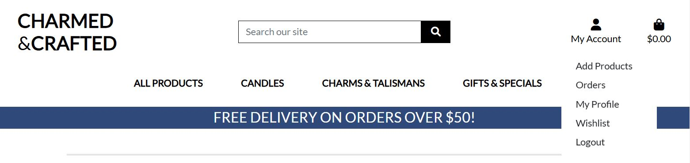

# Charmed & Crafted  
## Your Destination for Unique Artisan Creations  

Welcome to **Charmed & Crafted**, an e-commerce platform dedicated to showcasing and selling handcrafted, one-of-a-kind products. 
Discover unique candles, charms, and personalized gifts made with love and care by talented artisans. 
Whether you're shopping for yourself or looking for the perfect gift, **Charmed & Crafted** is here to bring artisanal beauty to your doorstep.

## Explore Our Collections  
[Visit Charmed & Crafted Online Store](https://charmed-crafted-4f4e1e02f356.herokuapp.com/)  

# Table of Contents

- [Project Overview](#project-overview)
  - [Purpose](#purpose)
  - [Existing Features](#existing-features)
- [Technical Design](#technical-design)
  - [WireFrames](#wireframes)
  - [Models Relationships](#models-relationships)
- [Technologies](#technologies)
- [Main Used Libraries](#main-used-libraries)
- [Testing and Fixing Bugs](#testing-and-fixing-bugs)
- [Deployment](#deployment)
  - [GitHub Forking](#github-forking)
  - [Heroku Deployment](#heroku-deployment)
- [Credits](#credits)

## Project Overview

### Purpose:

This project serves as an educational resource, demonstrating the application of Python development skills in building a comprehensive, fully functional e-commerce platform. The project showcases how **Django** can be leveraged to create a scalable, interactive, and secure application, with a focus on user experience, data management, and thorough testing. 

The system includes features such as:
- **Stripe Payments** for secure and reliable online transactions.
- A robust e-commerce platform supporting product browsing, filtering, and detailed product views.
- **AWS S3** for scalable and reliable storage of media and static files.
- A responsive and visually appealing design using **Bootstrap**.

This project exemplifies how **Python**, **Django**, **Bootstrap**, **Stripe**, and **AWS** can be combined to build a fully functional, secure, and visually appealing web application, taking into account real-world considerations like payment integration, scalability, and performance.

### Existing Features

#### Navigation bar

- The Navigation bar is customized for the three types of logins: Administrator, Registered user, and non-registered users.
        

Administrator Navbar

        

Normal User NavBar

        

Not Logged-in NavBar

#### Main Page

- Cozy Welcome page. 
- Easy access to full store through the explore our collection button.
- Easy Navigation through products, categories straigth from the home page.
        

Main Page

#### Footer

Footer
The footer of Charmed & Crafted provides easy access to important sections and contact options for users.
It is designed to enhance navigation, improve user experience, and provide essential information in a structured format.
        

Footer

#### Key Footer Sections:

### Key Sections:

#### Explore:
This section allows users to explore the store, learn about the brand, and connect with the team.

- **Shop**  
  Redirects users to the main product page where they can browse all available products.  
        

Shop

- **Our Story**  
  This page gives a brief introduction about the store's mission, values, and history.  
        

Our Story

- **Contact Us**  
  Users can find contact details or a form to directly get in touch with the store for inquiries, feedback, or support.  
        

Contact Us

#### Customer Care:
Essential links to help customers with policies and common queries.

- **Shipping & Returns**  
  Information on shipping policies, expected delivery times, and the return process.  
        

- **FAQs**  
  A dedicated FAQ page to answer common questions about products, services, and more.  
        

FAQs

- **Privacy Policy**  
  Details the store’s commitment to protecting customer data and privacy.  
        

Privacy Policy

- **Terms & Conditions**  
  Outlines the terms and conditions for using the store's website and services.  
        

Terms & Conditions

#### Get Involved:
This section provides information on workshops or events organized by the store to foster community engagement and creativity.  
        

Get Involved

#### Store Hours:
Displays the store's operating hours and emphasizes availability for appointments.

- Monday–Friday: 11am–5pm  
- Saturday & Sunday: 10am–6pm  
  **By Appointment Only**  
        

Store Hours

#### Stay Connected:
Encourages users to subscribe for updates, offers, and inspiration. Includes a subscription form for entering an email address.  
        

Stay Connected

#### Social Media Links:
Icons linking to social media platforms such as:
- Facebook  
- Instagram  
- YouTube  
- Pinterest  
- TikTok  

These links allow users to follow the store for updates, promotions, and community engagement.  
        

Social Media Links

#### Sign up/Login page

- Simple, quick signup with confirmation email.
        

Signup

        

Confirmation Email Page

        

Confirmation user Email

- The Login Page has a button to the signup page in case the person is not yet a user.
        

Login

        

Toast Success Login

- The Signout Page has a button to confirm sign out or cancel.
        

Sign Out

         

Toast Success Signed out

#### Book Suggestions Forms

- Open the Suggestion book page in case anyone wants to suggest new books. 
        

Book Suggestion Form

- Thank you submission page.
        

Thank you page

- Easy and clean admin interface to view the book suggestions.
        

Admin Interface

#### Book Issuance System

- Easy issuance when you click on a book cover, you will be directed to book details where, if logged in, it will show the option to book it; otherwise, it will show the login button.
        

Book Detail No User

        

Book Detail User Connected

- Confirmation screen showing the details of your issuance.
        

Issuance Details

- You can see your history and return the books on the My Issued Books Link on the Navigation bar.
        

My Issued Books

- When returning a book, as a good practice, it has a confirmation.
        

Return Book Confirmation

        

Book Return Notification

#### Book Collection

- The book collection has a search bar to search a title and shows the book cover and book name for easy visualization.
        

Book Collection

- When logged in as an admin, it shows the option at the top to add new books.
        

Admin Book Collection Interface

#### Administrator CRUD Function

- As a web administrator, it is possible to add, update, or delete books.
    - Adding a book:
        1. On the Book Collection page as an Administrator, a button labeled "Add book" will be shown.
                

Add a book

        2. The link will bring you to a page where you can fill out the form to add a book.
                

Add a book form

        3. If a book cover is not loaded, it will automatically add a placeholder image saying "Book image not available."
                

Book Image not Available

- As a web administrator, when on book details, the buttons to update and delete the book will be visible.
            

CRUD Options

    - Updating a book:
        1. Click on "Edit book."
        2. The "Update Book" page will open where you can change all book information.
                

Update Book

    - Deleting a book:
        1. Click on "Delete book."
        2. You will be directed to a deletion page for confirmation.
                

Delete Book

#### Footer with Social Media Links  

- The footer has social media links that open in a new page.
            

Footer

#### Error Pages.

- Page not found 404.
        

404 page

- Internal Server Error 500 .
        

500 page

        

#### Extra Functions

- Late fee function: If the book is not returned in 14 days, a $1 fee will be applied for each day of delay.
        

Late Fee

- You cannot issue two copies of the same title at once.
        

Book Already Issued Notification

- You can only issue 3 books at once.
        

Max Issue Notification

- Book out of stock.
        

Book Out of Stock Notification

## Technical Design

### WireFrames

- When the VIL-MASYS project began, I created basic wireframes to outline the initial design and functionality of the application. These wireframes served as a starting point to visualize the core structure and user flow. However, as development progressed, significant changes were made to improve the user experience, functionality, and overall design.

- Initial WireFrame Design:
        

Home

        

Book Info

        

Login

        

Issued Book

        

About

- Key Changes:
    - Enhanced User Interface: The initial wireframes were simple and lacked the visual appeal needed for a modern web application. As the project evolved, I introduced a more polished and intuitive interface, incorporating feedback and best practices in UI/UX design.

    - Expanded Features: Originally, the wireframes focused on basic functionalities. During development, new features were added, such as personalized book recommendations, late fees, notifications, and advanced search capabilities, which were not part of the initial plan.

    - Improved Navigation and Layout: The initial wireframes had a straightforward but somewhat limited navigation structure. I restructured the layout to provide a more seamless and logical flow, making it easier for users to navigate between different sections of the application.

### Models Relationships

- Key Relationships:
    1. Book and IssuedBook Relationship
        - Relationship Type: One-to-Many (ForeignKey)
            Explanation:
            - The Book model represents each book in the library's collection.
            - The IssuedBook model keeps track of each instance where a book is issued to a user.
            - A single Book can be issued multiple times, hence the one-to-many relationship. This is implemented using a ForeignKey in the IssuedBook model that references the Book model.
            - The related_name='issued_books' allows you to access all issued records for a particular book using book.issued_books.all().
    2. User and IssuedBook Relationship
        - Relationship Type: One-to-Many (ForeignKey)
            Explanation:
            - The User model (from Django’s built-in authentication system) represents the users of the library system.
            - Each user can issue multiple books over time. Therefore, there is a one-to-many relationship between User and IssuedBook.
            - The ForeignKey in the IssuedBook model links each issued book to the specific user who has borrowed it.
            - The related_name='issued_books' allows you to retrieve all the books issued by a particular user using user.issued_books.all().
    3. BookSuggestion Model
    - Standalone Entity:
            - The BookSuggestion model is independent of the Book and IssuedBook models. It captures suggestions for new books that users want to see in the library.
            - This model contains information about the suggested book's title and author, as well as optional fields for the user’s name, email, and reason for suggesting the book.
            - While this model is not directly related to the Book or User models through foreign keys, it plays an important role in allowing users to contribute to the library’s growth.

    

Relations

## Technologies

### Backend and Frameworks:

- **Python:** Core programming language used for the project.
- **Django:** Web framework for building the application's backend, handling models, views, and forms.
- **Django ORM:** For database interactions and queries.

### Frontend:

- **HTML/CSS:** For structuring and styling the web pages.
- **Bootstrap:** CSS framework for responsive design and UI components like the navbar and forms.

### Database:

- **SQLite:** Default database used by Django for development/tests.
- **PostgreSQL**:  Database for production.

### Storage:

-  **Cloudinary:** For managing and storing media files such as images.

### User Authentication:
- **Django's Authentication System:** For handling user registration, login, and permissions.

### Testing:
- **Django Test Framework:** For unit and integration testing of models, views, and forms.
- **Unittest:** Python's standard library for writing and running tests.

- **Visual Studio Code:** Local IDE.

### Tools and Utilities:
- **Git:** Version control system for tracking changes and collaborating.
- **GitHub:**  Platform for hosting the project repository.

### Deployment:
- **Heroku:** Cloud Deployment.

### Others:
- **Timezone and Date/Time Handling:** Managing timezones and datetime objects for accurate timestamps.
- **Coverage:** Generate automated test reports.

## Main used Libraries

- **Django:** The main web framework used to build your application.
- **Django Rest Framework (DRF):** for building APIs.
- **Bootstrap:** For frontend styling and responsive design.
- **Pillow:** For image handling in Django.
- **Cloudinary:** For storing and serving media files (images) in the cloud.
- **Unittest:** For writing and running tests in Django application.
- **Django Messages Framework:** For displaying flash messages to users.
- **Django Paginator:** For handling pagination in your views.
- **PostgreSQL:** As the database backend.
- **Django Crispy Forms:** To make Django forms more elegant and manageable.
- **Gunicorn:** As a Python WSGI HTTP Server for serving your application.
- **Whitenoise:** For serving static files in production.
- **Django Storage:** For managing storage in cloud environments.

## Testing and Fixing Bugs

### Debugging 

  - For debugging the python code, `print` statements were used together with debugging tools and console logs to help identify bugs, loops, and condition interactions. 

  **Debugging Tools**

   - [CI Python Linter - Code Institute](https://pep8ci.herokuapp.com/)  
   - [OpenAI Chat](https://chat.openai.com/)
   - [Perplexity AI](https://www.perplexity.ai/) 

## Testing 

- The page of tests can be found at the link below:
        [Project Test documentation](TESTING.md)

## Deployment

### Github Forking

- **Forking the GitHub Repository**
  - If you want to make changes to your repository without affecting it, you can make a copy of it by 'Forking' it. This ensures your original repository remains unchanged.

  1. Find the relevant GitHub repository
  2. In the top right corner of the page, click the Fork button (under your account)
  3. Your repository has now been 'Forked' and you have a copy to work on

- **Cloning the GitHub Repository**
  - Cloning your repository will allow you to download a local version of the repository to work on. Cloning can also be a great way to backup your work.

  1. Find the relevant GitHub repository
  2. Press the arrow on the Code button
  3. Copy the link that is shown in the drop-down
  4. Open the terminal 
  5. Move to the folder where you want to clone it
  6. In the terminal type `git clone` and then paste the link you copied in GitHub
  7. Press enter and your local clone will be created.

- Live link: [GitHub Link](https://github.com/Volneirj/project_iv_ci)

### Heroku Deployment

- **Creating Requirements.txt**
    - For Heroku to be able to install the required dependencies, it is necessary to create a file where the needed dependencies are listed.

    1. Create a file named `requirements.txt`.
    2. Run the command: `pip3 freeze >requirements.txt`.
    3. Check if the file has been updated, as shown in the image below.

- **Creating an Application with Heroku**
    - To deploy and run the application on the Heroku platform, it is necessary to follow a few steps:

    1. Login or create an account on the Heroku website.
    2. Click on "Create a new app."

3. After creating the new app, you need to configure the settings.
4. The first setting that needs to be done is to add your environment info to the platform so it will be able to access outside sources.

5. Add the Buildpacks necessary to run the application, in this case, Python and Node.js in this sequence.

6. After completing the settings, move to the deploy tab where you will configure the deployment setup.
7. Connect your GitHub.
8. Select your repository on GitHub.
9. Connect to the repository.

10. After all the settings above have been done, you can select to deploy automatically or manually.

11. After pressing deploy, if all settings are correct, you should see it building the application.

12. After all steps of deployment, a button labeled "View" will be shown, where you can click to open a new tab with the application.

## Credits

**Mentor:** [Harry Dhillon](https://github.com/Harry-Leepz/)

**Base template:** [Code Instutute: I Think Therefore I Blog](https://github.com/Code-Institute-Solutions/blog/)

**Book Covers:** Created Using [Canva](https://www.canva.com/)

**Book/Title Descriptions:** Generated with [ChatGPT](https://chatgpt.com/)