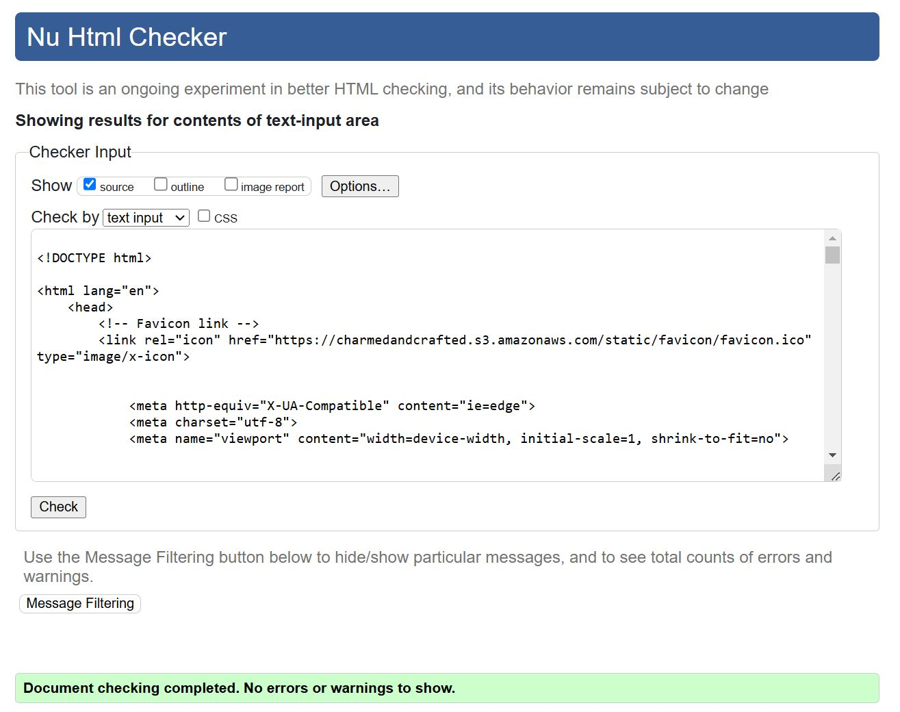

### HTML

All HTML pages were validated using the [W3C HTML Validator](https://validator.w3.org/). One error was identified on the Signup page, which will be discussed in the bugs and errors section.

| Page                                                                                                               | Result |
|-------------------------------------------------------------------------------------------------------------------|--------|
| 

Home

        | PASS   |
| 

Contact Us

 | PASS   |
| 

Our Story

 | PASS   |
| 

Shipping Returns

 | PASS   |
| 

FAQs

         | PASS   |
| 

Privacy Policy

 | PASS   |
| 

Terms & Conditions

 | PASS   |
| 

Workshops

 | PASS   |
| 

Products

 | PASS   |
| 

Add Product

 | PASS   |
| 

Edit Product

 | PASS   |
| 

Product Detail

 | PASS   |
| 

Wishlist

 | PASS   |
| 

Bag

         | PASS   |
| 

Checkout

 | PASS   |
| 

Checkout Success

 | PASS   |
| 

Profile

 | PASS   |
| 

Register

     | ERROR   |
| 

Login

     | PASS   |
| 

Logout

   | PASS   |
| 

Password Recovery

 | PASS   |

The HTML error is explained at [Bugs and Errors](#bugs-and-errors)

### CSS

- Using the [W3C CSS Validator](https://jigsaw.w3.org/css-validator/), the CSS code was checked for errors using the direct input option.

  

### Python

- Using the [CI Python Linter - Code Institute](https://pep8ci.herokuapp.com/), the Python code was inspected and validated. All `.py` files were checked, and most issues found were related to missing or extra blank lines and long lines. All issues were fixed.

## Responsiveness and Device Testing

Throughout the development process, the website was rigorously tested across a range of devices, including desktops, laptops, smartphones, and tablets. This testing ensured that the website displayed correctly on screens of various sizes and orientations, both portrait and landscape. Additionally, the responsive design was validated using Google Chrome's developer tools to confirm that the layout remained structurally sound and adaptable across different screen dimensions. No issues were noted, affirming that the site functions as expected across diverse environments.

## Browser Testing

The website was tested across Google Chrome, Safari, and Microsoft Edge, and no issues were found.

## Manual and Automated Testing

To ensure thorough testing, organization, and control throughout the development process, all testing activities were meticulously aligned with the requirements and acceptance criteria outlined in the epic and related user stories. This structured approach allowed us to systematically cover every aspect of the application, ensuring comprehensive test coverage and alignment with project goals.

[Comprehensive Testing for Charmed&Crafted E-Commerce](https://github.com/Volneirj/project_v_ci_v1/issues/44)

### Automated Testing

To achieve a robust and reliable application, a comprehensive testing strategy was implemented, combining both manual and automated methods. Leveraging Django's built-in testing framework, automated tests were meticulously developed to cover critical functionalities, including views and forms.

Each test was directly tied to specific user stories, ensuring that the application not only met technical requirements but also aligned with user needs and expectations. This approach provided thorough coverage, verifying that the application behaves as expected under various scenarios and that all features deliver the intended user experience.

To run the tests, I executed the following command in the terminal:

`python3 manage.py test`

Total Count of Automated Tests: 41

  

To create the coverage report, I ran the following commands:

`coverage run --source=name-of-app manage.py test`

`coverage report`

Below are the reports on automated tests.

| App    | Screenshot                                                                 | 
| ------ | -------------------------------------------------------------------------- | 
| Home   |            |
| Books  |           |
| Issues |          |
| Users  |           |
| About  |           |

### Manual Testing

A comprehensive manual testing process was conducted to address areas that automated tests could not cover. Every test has been documented in the user stories below, where they are meticulously organized by application and test type to ensure complete coverage and clarity.

[User Story 34 - Bag App Manual Test 1 - Shopping Bag Functionality](https://github.com/Volneirj/project_v_ci_v1/issues/34)

[User Story 35 - Bag App Manual Test 2 - Context and Navigation](https://github.com/Volneirj/project_v_ci_v1/issues/35)

[User Story 36 - Checkout Manual Test 1 - Checkout Process](https://github.com/Volneirj/project_v_ci_v1/issues/36)

[User Story 37 - Checkout Manual Test - Stripe Webhooks](https://github.com/Volneirj/project_v_ci_v1/issues/37)

[User Story 38 - Home App Manual Tests 1 - Static Pages](https://github.com/Volneirj/project_v_ci_v1/issues/38)

[User Story 39 - Home App Manual Test 2 - Subscription Form](https://github.com/Volneirj/project_v_ci_v1/issues/39)

[User Story 40 - Product App Manual Test 1 - Product Browsing and Interaction](https://github.com/Volneirj/project_v_ci_v1/issues/40)

[User Story 41 - Products App Manual Test - Product Administration (CRUD)](https://github.com/Volneirj/project_v_ci_v1/issues/41)

[User Story 42 - Profile App Manual Test - User Profile and Order Management](https://github.com/Volneirj/project_v_ci_v1/issues/42)

[User Story 43 - User and Web Browsing Functional Tests](https://github.com/Volneirj/project_v_ci_v1/issues/43)  

### Bugs and Errors

Two issues were identified during testing: one related to CSRF token handling in the checkout workflow and another concerning toast notifications failing to dismiss properly on the frontend. The first bug caused a "403 Forbidden" error during CSRF-protected POST requests, and the second issue prevented users from dismissing notifications smoothly.

The resolutions for both bugs are detailed below.

Bug 1: CSRF Token Cookie Issue for Secure POST Requests
[User Story 27 - Fix CSRF Token Cookie Issue for Secure POST Requests](https://github.com/Volneirj/project_v_ci_v1/issues/27)

- Description: Actions requiring CSRF-protected POST requests, such as adding items to the wishlist or submitting forms, triggered a "403 Forbidden: CSRF token from POST incorrect" error.
- Root Cause: The csrftoken cookie was not being set correctly when users visited pages that required CSRF protection.
- Solution:
Added the @ensure_csrf_cookie decorator to views rendering forms or pages performing CSRF-protected actions.
This ensures the CSRF token cookie is set automatically for secure interactions.

Bug 2: Toast Notifications Do Not Dismiss Properly
[User Story 26 - Toast Notifications Do Not Dismiss Properly](https://github.com/Volneirj/project_v_ci_v1/issues/26)

- Description: Users were unable to dismiss toast notifications (e.g., success or error messages) using the close button (x). This caused the toasts to persist unnecessarily.
- Root Cause: The closing HTML tag for the toast container was misplaced, breaking the dismissal behavior.
Solution:
- Fixed the placement of the closing 
 tag in the toast template.
Ensured that the data-dismiss (Bootstrap 4) attribute was used correctly for the close button.

HTML Validation Issue: 
Regarding the HTML validation error, I have chosen to leave it as is since it does not impact the application's functionality and is caused by Crispy Forms. Below, you can see the error encountered during validation testing with the [W3C HTML Validator](https://validator.w3.org/). The second image highlights the specific line where the error occurs, identified through page inspection.

